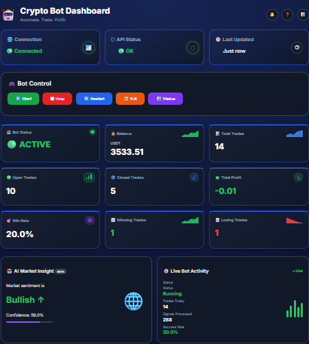
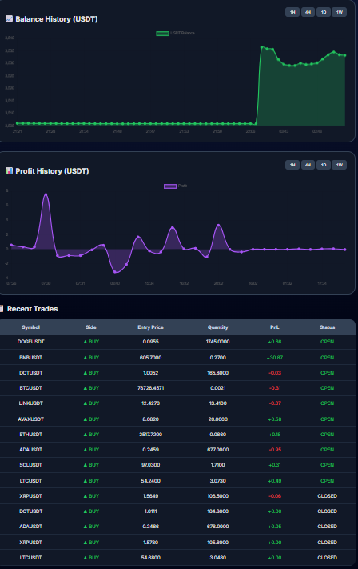
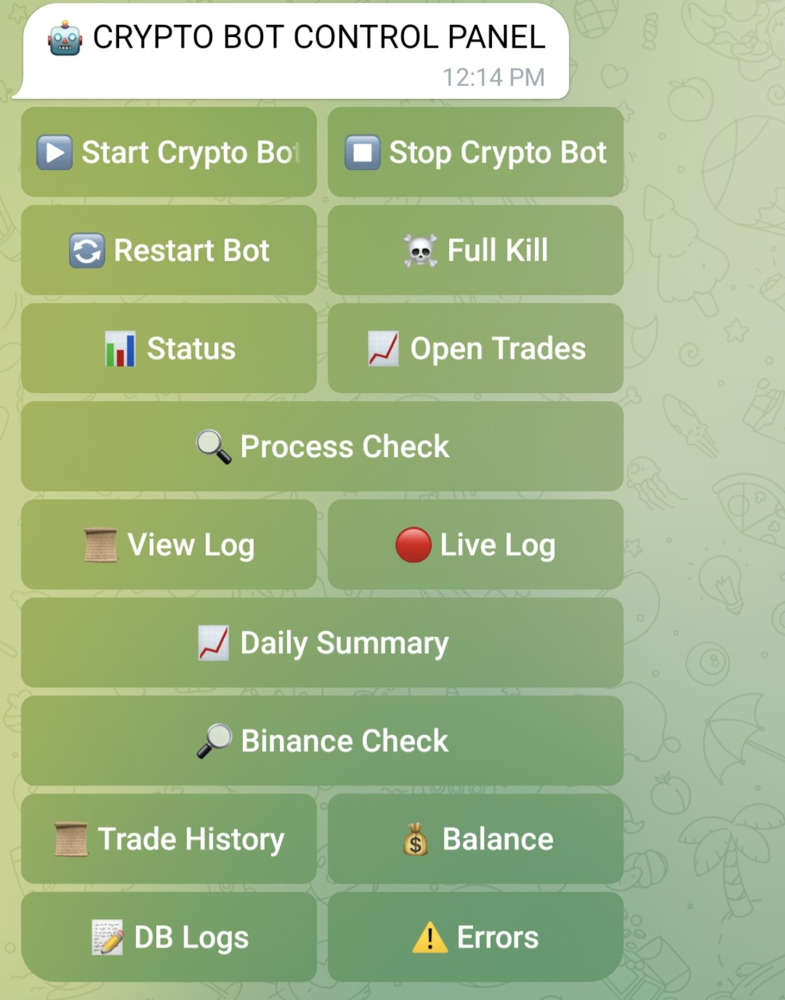

# Crypto Trading Bot

A Python-based automated cryptocurrency trading system featuring real-time
trade execution, a FastAPI monitoring dashboard, PostgreSQL data storage,
Telegram-based monitoring/control, Docker containerization, and Linux
systemd deployment.

## 🚀 Key Features

- Automated cryptocurrency trading
- Multi-pair market monitoring
- Real-time trading signals and alerts
- FastAPI web dashboard
- PostgreSQL trade data storage
- Telegram status notifications
- Telegram signal alerts
- Daily trading summaries
- Telegram control panel
- Docker & Docker Compose deployment
- Linux systemd deployment
- GitHub Actions CI checks

## 🛠️ Technologies

- Python
- FastAPI
- PostgreSQL
- Binance API
- Telegram Bot API
- Docker
- Docker Compose
- Git & GitHub
- GitHub Actions
- Linux / Ubuntu
- systemd
- HTML / CSS / JavaScript

## 🏗️ Project Architecture

Trading Strategy
        ↓
   Binance API
        ↓
   Trading Bot
        ↓
   PostgreSQL
        ↓
   FastAPI Dashboard

Trading Bot
   ├── Status Bot
   ├── Signal Bot
   └── Daily Summary Bot

Telegram Control Panel
   └── Start / Stop / Restart / Status

## 📂 Main Components

- `crypto_bot.py` — main automated trading system
- `api.py` — FastAPI dashboard backend for systemd deployment
- `api_docker.py` — FastAPI dashboard backend for Docker deployment
- `control_panel_bot.py` — Telegram control panel for systemd
- `docker_control_panel_bot.py` — Telegram control panel for Docker
- `database.py` — PostgreSQL integration
- `docker-compose.yml` — multi-container configuration
- `Dockerfile` — Docker image configuration

## 🔐 Security

Sensitive credentials are managed using environment variables and are not
stored in the repository.

This includes:

- Exchange API credentials
- Telegram bot tokens
- Database credentials

## 🐳 Deployment

The project supports two deployment methods:

1. Docker Compose
2. Linux systemd

This provides flexibility between containerized and native Linux deployment.

## 🔄 Continuous Integration

GitHub Actions automatically performs:

- Python syntax validation
- Docker image build validation

Checks run automatically when code is pushed to the `main` branch.

## 👨‍💻 Project Type

**Personal / Independent Project**

Designed, developed, deployed, and maintained as a practical project for
automated trading and software engineering experience.

## Screenshots

### Trading Dashboard

The web dashboard provides real-time monitoring of the trading system, account information, trades, and bot status.

### Trading Performance & Charts

Dashboard charts provide a visual overview of trading and account performance.

### Telegram Control Panel

The Telegram control panel provides remote monitoring and management of the trading system, including bot controls, status checks, open trades, logs, balance, trade history, and error monitoring.

